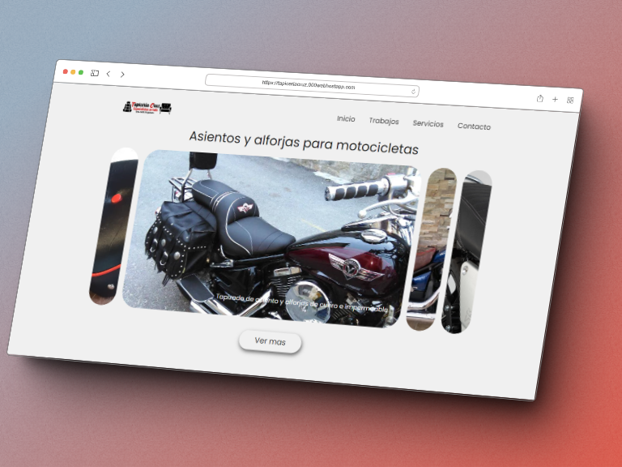

  
  
   

  <a href="https://dianacruzpro.netlify.app/" title="Diana Cruz's Portfolio" target="_blank">
    <!--  -->
    
  </a>
   
  

Since childhood my taste for technology was notorious and as I introduced myself to the area, I observed that web development is my vocation, in which <strong style="color:#107EAB;"> every day I put my best effort to innovate and update my learning</strong>.

I'm <strong style="color:#107EAB;">Frontend Developer</strong>, enjoy doing the layout and interactivity of web interfaces, optimization, for the good positioning and performance of websites and applications.

 
<h2 align="center">
  
</h2>

  
  
  
  
  
  
  
   
  
  

 

<h2 align="center">
    
</h2>

  

  <a href="https://github.com/dianacruzpro/SitioWeb-Tapiceria" title="Upholstery WebSite | Diana Cruz">
      <!-- </img> -->
      </img>
      </img>
      </img>
  </a>

